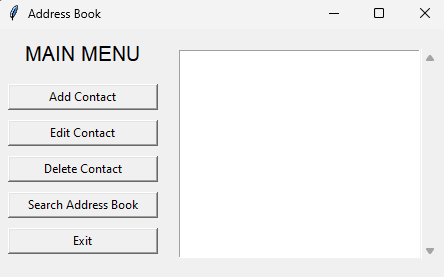

# Address Book Python Program

This is a Python-based Address Book application that allows users to manage their contacts. The application can store 100 or more entries and includes features for adding, editing, deleting, viewing, and searching contacts. Data validation is performed for both contact information and user responses.

## Features

1. **Add Contact**
   - The user is prompted to enter the first name, last name, address, and contact number of the person they want to add.

2. **Edit Contact**
   - The user can edit an existing contact by providing the entry number they wish to modify.

3. **Delete Contact**
   - The user can delete a contact by specifying its entry number. Once a contact is deleted, the subsequent entries will automatically move forward.

4. **View Contacts**
   - Displays all the entries in the address book.

5. **Search Address Book**
   - The user can search the address book by:
     - First Name
     - Last Name
     - Address
     - Contact Number
   - If a match is found, the entry is displayed; otherwise, a notification that the entry doesn't exist will appear.

6. **Exit**
   - Safely closes the program.

## New Feature: GUI Version

In addition to the command-line version of the address book, we have added a **Graphical User Interface (GUI)** version of the application. The GUI version offers a more user-friendly and interactive experience for managing contacts.

### How to Use the GUI Version

1. **Installation**: 
   - Ensure you have `Tkinter` installed, as the GUI version is built using Python's Tkinter library.

   ```bash
   pip install tk
   ```

2. **Running the GUI Version**: 
   - Navigate to the folder containing the address book program.
   - Run the GUI version of the program by executing the following command:

   ```bash
   python address_book_gui.py
   ```

3. **Using the GUI**: 
   - The graphical interface provides easy buttons and input fields for adding, editing, deleting, viewing, and searching contacts.

## Requirements

- Python 3.x
- For GUI version: Tkinter library (usually included with Python)

## Sample CLI Output

```
<<<<<<<<<<<<<<<<<< MAIN MENU >>>>>>>>>>>>>>>>>>>
What would you like to do?
[1] Add Contact
[2] Edit Contact
[3] Delete Contact
[4] View Contact
[5] Search Address Book
[6] Exit
Choose the number corresponding to your choice: 
```

## Sample GUI Output


## How to Run (Command-Line Version)

1. Clone or download the repository.
2. Run the `address_book.py` file:

```bash
python address_book.py
```

3. Follow the prompts to add, edit, delete, view, or search contacts.